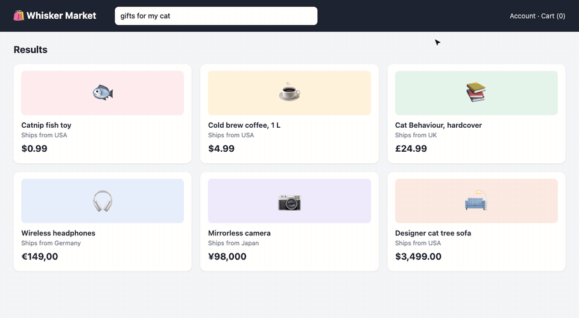
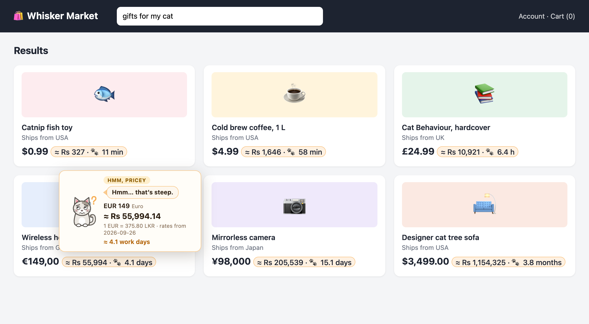
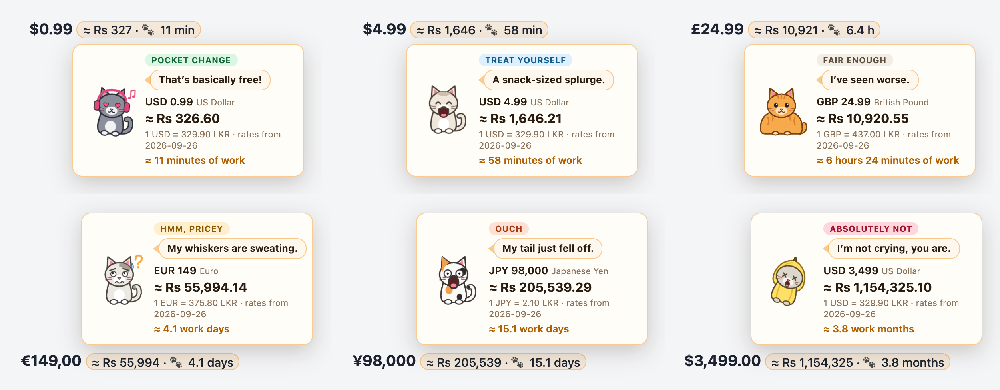
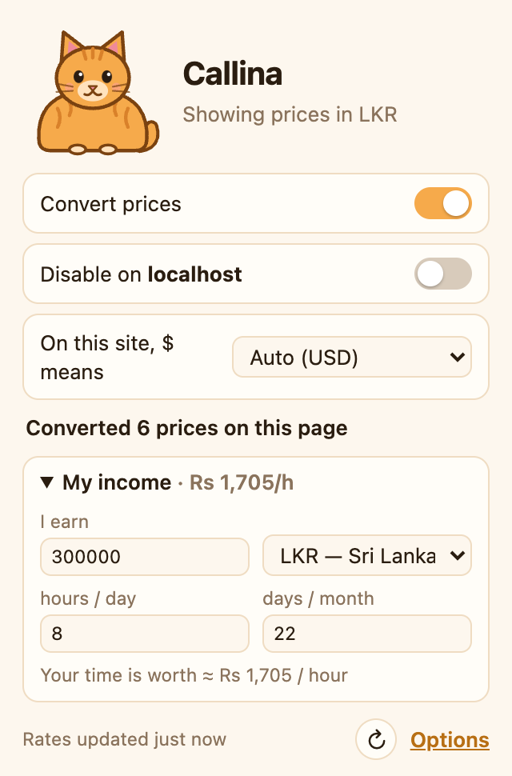
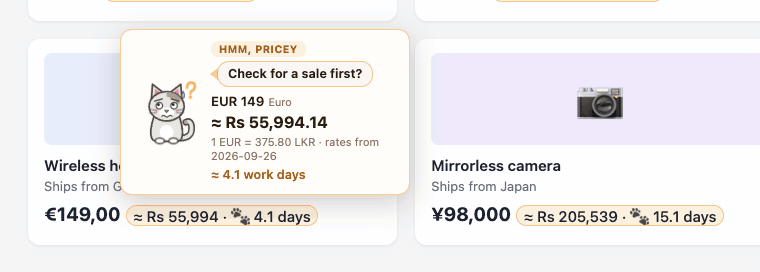
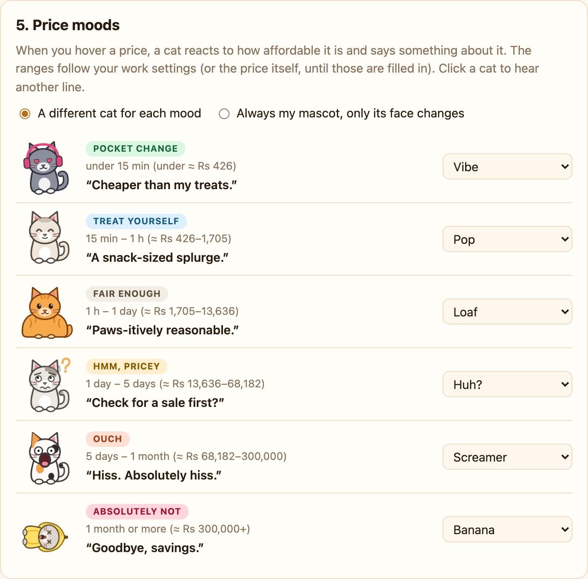
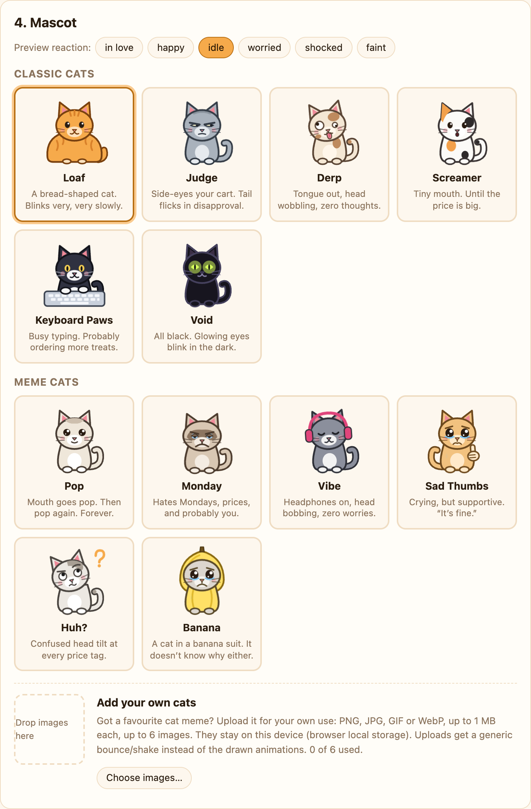
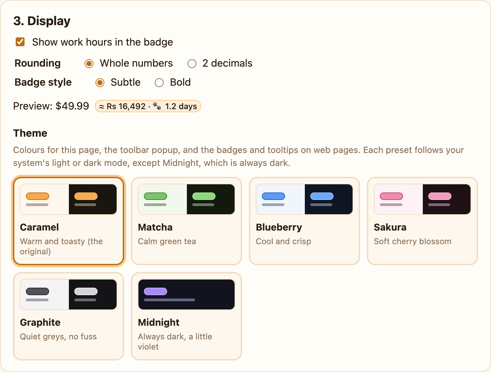

<div align="center">

# Callina 🐱

**See what foreign prices really cost you, in your own currency and in hours of your work.**
**A judgmental cartoon cat reacts to every price.**

`$49.99` → `$49.99 [≈ Rs 16,492 · 🐾 2.4 h]`

No accounts · no backend · no analytics · no build step



<sub>▶ <a href="docs/demo.mp4">Sharper MP4 version</a></sub>

</div>

## At a glance

| Every price gets a badge | Hover it for a cat's opinion |
|---|---|
|  |  |

| Toolbar popup | Colour themes, applied live |
|---|---|
|  |  |

- **Finds prices on any page**: `$ € £ ¥ ₹ Rs` and about 40 currencies, in any number format.
- **Converts them** to your home currency (Sri Lankan Rupees by default).
- **Shows work time**: how many minutes, hours or days you'd work to pay for it.
- **Reacts with a cat**: 12 original animated cats, 6 price moods, lots of bad puns.
- **Private**: the only request it makes is for a public exchange-rate table.

## Install

1. Open `chrome://extensions` (Edge: `edge://extensions`, Brave: `brave://extensions`).
2. Turn on **Developer mode**.
3. Click **Load unpacked** and choose this `callina/` folder.

Then click the Callina icon and fill in **My income** to see prices in hours of work.

> To try the test page (`tests/fixtures/prices.html`) from disk, open the extension's **Details** and turn on **Allow access to file URLs**.

## Price moods

Every price falls into one of six moods. Each mood has its own cat, face and set of one-liners.

| Mood | With income set | Price only | Default cat | Example line |
|---|---|---|---|---|
| 💚 Pocket change | under 15 min | under $5 | Vibe | “Purr-fect price!” |
| 💙 Treat yourself | 15 min – 1 h | $5–25 | Pop | “Meow-velous deal!” |
| 🤎 Fair enough | 1 h – 1 workday | $25–100 | Loaf | “Not bad, human.” |
| 💛 Hmm, pricey | 1 – 5 workdays | $100–500 | Huh? | “My whiskers are sweating.” |
| 🧡 Ouch | 5 workdays – 1 work month | $500–2,500 | Screamer | “HOW MUCH?!” |
| ❤️ Absolutely not | a work month or more | over $2,500 | Banana | “This cat has left the chat.” |

- Workdays and work months follow your own hours/day and days/month.
- Price-only limits are converted into your home currency.
- Prefer one cat? Choose **Always my mascot**, and only its face changes.

<details>
<summary>📸 Options page screenshots</summary>







</details>

## Features

### 🔎 Price detection

- **Symbols:** `$ € £ ¥ ₹ ₩ ₽ ₺ ₫ ฿ ₱ R$ A$ C$ CA$ S$ HK$ NZ$ US$ Rs Rs. RM kr zł Fr. CHF 円 …`
- **ISO codes:** `USD 49`, `49 USD`, `EUR49`.
- **Number formats:** `1,234.56`, `1.234,56`, `1 234,56`, lakh grouping (`₹1,00,000`), `$1.2k`, `£5m`, `$2 billion`.
- **Ranges:** `$10 – $20` (two badges) and `$10–20` (one badge showing the range).
- **Split prices:** Amazon's `<span>$</span><span>49</span><span>.99</span>` and `$49<sup>99</sup>`.
- Malformed grouping like `1,234,5` is ignored rather than guessed.

<details>
<summary>How ambiguous symbols (<code>$</code>, <code>¥</code>, <code>kr</code>, <code>Rs</code>) are resolved</summary>

In this order:

1. An explicit prefix (`US$`, `C$`, `CN¥`, …).
2. The page's structured data (`priceCurrency` microdata or JSON-LD, `product:price:currency`).
3. Your per-site `$` setting in the popup.
4. The site's domain (`.ca` → CAD, `.com.au` → AUD, `.cn` → CNY, `.lk` → LKR, …).
5. Defaults: `$` → USD, `¥` → JPY, `Rs` → LKR if your home currency is LKR, otherwise INR.

</details>

### ⏱️ Work hours

- Enter your monthly income, hours per day and days per month.
- Each badge shows how long you'd work for that price: `35 min`, `2.4 h`, `3.5 days`, `1.2 months`.
- Invalid or empty income hides the work time everywhere.

### 💬 Tooltip

Open it by hovering, tapping (touch screens) or tabbing to a badge. Escape closes it. It shows:

- the original amount and currency, and a more precise conversion
- the rate used and its date
- the work time in words (“≈ 2 hours 24 minutes of work”)
- a cat whose identity, face and one-liner match the price mood

### 🐈 Cats

- **Classic:** Loaf, Judge, Derp, Screamer, Keyboard Paws, Void.
- **Meme cats:** Pop, Monday, Vibe, Sad Thumbs, Huh?, Banana. Each riffs on a famous cat-meme format, with original art.
- **Your own:** upload up to 6 PNG/JPG/GIF/WebP images (up to 1 MB each). Uploads get a generic bounce/shake.
- All drawn as hand-written SVG with CSS animations. The toolbar icon follows the selected cat.
- `prefers-reduced-motion` freezes every cat in a static pose.

### ⚙️ Popup and Options

| Popup | Options page |
|---|---|
| On/off switch | Home currency (searchable, any currency the rate source supports) |
| Disable on this site | Work settings, with a “your time is worth ≈ Rs 1,250 / hour” preview |
| Per-site `$` override (when the page has `$` prices) | Display: work hours on/off, rounding, subtle or bold badge |
| Count of converted prices | Theme: Caramel, Matcha, Blueberry, Sakura, Graphite, Midnight |
| Rate freshness and a refresh button | Mascot picker and uploads |
| Quick income settings | Price moods: a cat per mood |
| | List of disabled sites |

- Settings changes apply to open tabs instantly, with no reload.
- Themes follow the system light/dark mode, except Midnight (always dark). Presets live in `shared/themes.js`.

## 💱 Exchange rates

No API key needed. The service worker tries these in order:

1. [`fawazahmed0/exchange-api`](https://github.com/fawazahmed0/exchange-api) via jsDelivr
2. The same data from its Cloudflare Pages mirror (`latest.currency-api.pages.dev`)
3. [ExchangeRate-API open access](https://www.exchangerate-api.com/docs/free) (`open.er-api.com`)

- **One USD-based table.** Any pair is cross-converted (`rate(A→B) = usd[B] / usd[A]`), so changing currencies never needs a new request.
- **Cached for 12 h.** Cached rates are served immediately and refreshed in the background when stale.
- **Offline-safe.** If every source fails, the last cached rates keep working and the popup shows “Offline · rates from &lt;date&gt;”.
- **Content scripts never fetch.** They ask the service worker for rates.

<details>
<summary>Sanity check and attribution</summary>

- A new table is accepted only if its major rates (EUR, GBP, JPY, CNY, INR, LKR, AUD, CAD, CHF, SGD) are within 25 % of the cached table, or a second source agrees with it within 5 %. So a single broken or compromised source can't silently change every price.
- On first install there is nothing cached; a second source is still asked, but if only one answers, its table is used.
- Full jsDelivr URL: `cdn.jsdelivr.net/npm/@fawazahmed0/currency-api@latest/v1/currencies/usd.min.json`.
- When ExchangeRate-API rates are in use, the popup and options page show its required “Rates By Exchange Rate API” link.

</details>

## 🔒 Privacy

**Callina makes one kind of request: fetching a public exchange-rate table.** It contains nothing about you or the pages you visit.

| Data | Stored in | Leaves your device? |
|---|---|---|
| Settings (home currency, **income**, disabled sites, per-site `$`) | `chrome.storage.sync` | Only via Chrome sync, to your own Google account |
| Uploaded cat images, rate cache | `chrome.storage.local` | No |

- No analytics, no remote code.
- **Permissions:** `storage`, host access to the three rate domains only, and a content script on all pages (needed to find prices).
- Uploads are shrunk to at most 256 px (small GIFs stay animated). A tab only reads the ones in use, the first time you open a tooltip.

<details>
<summary>What a web page can see</summary>

Badges are inserted into the page, so a page can tell Callina is installed. Their content is in a closed shadow root and carries no data attributes. But a page could still measure a badge's *width* to guess roughly how long its text is. That text includes the work-time estimate, so this could hint at your income bracket.

If that matters to you, turn off **Show work hours in the badge** (Options → Display). The tooltip still shows work time, and it only opens on real user input.

</details>

## 🧪 Tests

```
node --test tests/          # or: npm test
```

| File | Covers |
|---|---|
| `tests/parser.test.js` | number formats, symbol/ISO positions, ranges, magnitudes, non-prices (dates, phones, versions, %), the five ambiguity rules |
| `tests/convert.test.js` | cross rates, income validation, hourly-rate math, work-time wording, money formatting, badge text, the six moods |
| `tests/rates.test.js` | rate-table cleaning, the 25 %/5 % sanity checks, toolbar-icon validation |
| `tests/e2e.js` (optional) | the real extension in Chrome for Testing: fixtures, split prices, disable/restore, a 200 KB number dump. See the file header for setup. |
| `tests/fixtures/prices.html` | a manual page with 66 cases (48 prices, 2 dynamic, 16 must-not-convert). Rows turn green or red; home currency must be LKR. |

<details>
<summary>Tested on (2026-09-26, Chrome for Testing 154)</summary>

| Site | Result |
|---|---|
| Fixtures page | 66/66 pass |
| 3,000-product synthetic Amazon-style page | 6,000 badges in < 1 s, no long tasks (> 50 ms) while scanning or scrolling |
| en.wikipedia.org (List of most expensive paintings) | 410 prices, incl. `US$100 million`, `£24.75 million` |
| amazon.com search | every result price badged once (split-price markup, screen-reader copy skipped) |
| ebay.com search | works (`$45.00`, `Under $45.00`, `$20.00 to $80.00`) |
| aliexpress.com search | works, including ranges |
| theguardian.com | works (`£210m`, `£21bn`, `$1bn`) |
| booking.com | no prices until dates are chosen; from Sri Lanka it already shows LKR (nothing to convert) |

</details>

## ⚠️ Known limitations

- **Sites that already show your currency** (Amazon, Booking, …) are correctly left alone.
- **Wrong `$` guesses:** a `$` on a `.ca` site is read as CAD unless the page says otherwise. Fix it per site in the popup.
- **Not detected:** prices in images, `<canvas>`, cross-origin iframes, or other sites' shadow DOM.
- **Keyboard:** every badge is a Tab stop, so pages with many prices have many extra stops.

<details>
<summary>More edge cases</summary>

- **Prices split across unrelated elements.** `Total: <span>$</span><span>10</span>` inside a longer sentence isn't joined, because the combined text isn't *exactly* one price. Tight price wrappers (Amazon, eBay, most shops) are fine.
- **Space as thousands separator.** After a symbol (`$5 100`) a plain space is *not* a separator, so “$10 250 sold” reads as $10. Before a symbol (`3 100 USD`) it is, which can be wrong for “3 × 100 USD”. No-break and thin spaces are separators in both positions.
- **Very long text nodes** (over 20,000 characters) are skipped; they are data dumps, not price tags.
- **`PHP` below 10 is ignored**, so “PHP 8.2” (the language) isn't read as pesos.
- **Toolbar icon.** It updates when you open the popup or options page after changing the mascot on another synced device. It isn't animated; the optional “wiggle” was skipped as unreliable.
- **No real meme images are bundled.** Famous meme photos and art are copyrighted (and some, like Grumpy Cat, are trademarked), which gets extensions removed from the Chrome Web Store. The meme cats are original drawings. Users can add real memes for personal use through the upload feature.
- **Custom mascot and strict CSP.** On pages with a very strict CSP, the custom image may not load in the tooltip, which then falls back to Loaf.

</details>
